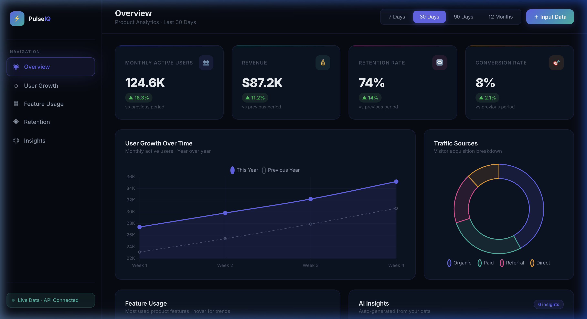
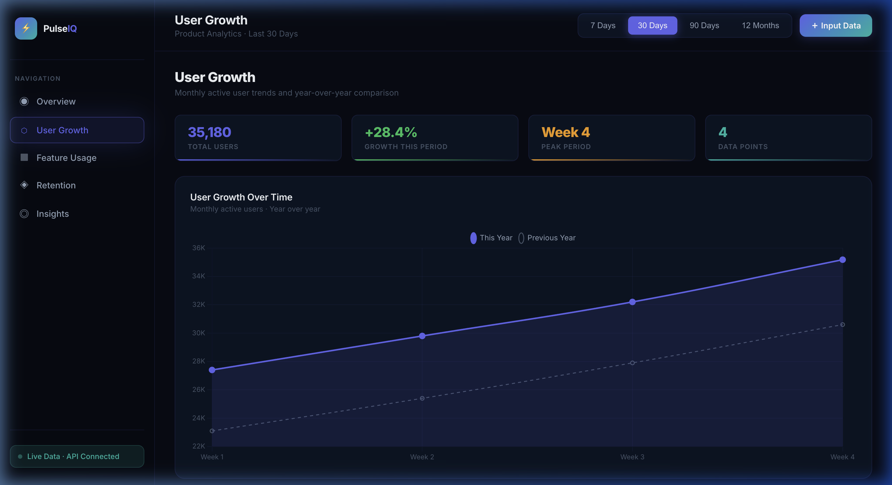
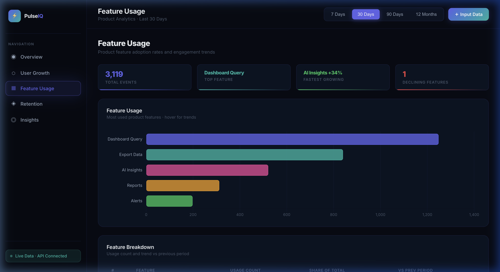
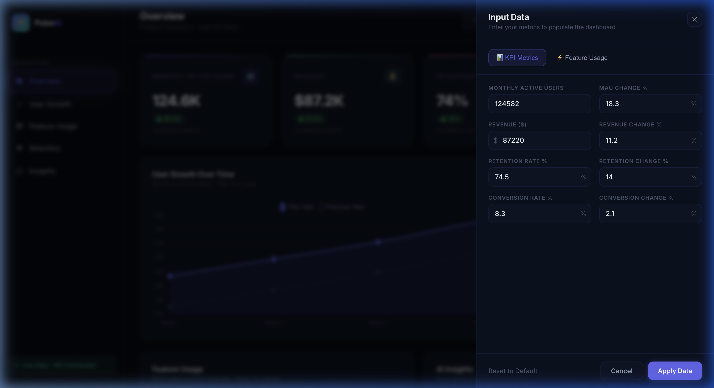

# AI Product Analytics Dashboard

A full-stack product analytics dashboard for monitoring KPIs, user behaviour, and product performance in real time. Built with **React** and **Python FastAPI**, featuring interactive Chart.js visualisations and a responsive dark-mode UI.

**[GitHub](https://github.com/chinweA/ai-product-analytics-dashboard) · [Live Demo](https://ai-product-analytics-dashboard.vercel.app)**

---

## Screenshots

### Overview Dashboard


### User Growth Analysis


### Feature Usage & AI Insights


### Data Input Panel


---

## Features

- **KPI Cards** — Monthly Active Users, Revenue, Retention Rate, Conversion Rate with animated counter roll-up and trend indicators
- **User Growth Chart** — Line chart with year-over-year comparison and gradient fill
- **Feature Usage** — Horizontal bar chart showing product feature adoption
- **Traffic Sources** — Doughnut chart breaking down Organic, Paid, Referral, and Direct
- **Retention Trend** — Weekly retention percentage with health-status badges and data table
- **AI Insights Panel** — Auto-generated observations from analytics data
- **Date Range Filter** — 7 Days · 30 Days · 90 Days · 12 Months — each backed by its own realistic dataset with the correct time granularity
- **Custom Data Input** — Slide-in panel to input your own metrics and update the dashboard instantly
- **Error & Loading States** — Skeleton loaders on every chart and an error recovery screen with retry

---

## Tech Stack

**Frontend:** React · Vite · Chart.js (`react-chartjs-2`) · Axios · Vanilla CSS

**Backend:** Python · FastAPI · Uvicorn

**Styling:** Dark-mode design system with glassmorphism, gradient fills, and micro-animations

**Deployment:** Vercel (frontend) · Render (backend)

---

## Project Structure

```
├── README.md
├── .gitignore
├── screenshots/
├── frontend/
│   ├── vercel.json
│   └── src/
│       ├── App.jsx
│       ├── index.css
│       ├── services/api.js
│       ├── components/
│       │   ├── KPICards.jsx
│       │   ├── UserGrowthChart.jsx
│       │   ├── RevenueChart.jsx
│       │   ├── FeatureUsage.jsx
│       │   ├── RetentionChart.jsx
│       │   ├── InsightsPanel.jsx
│       │   ├── FilterBar.jsx
│       │   ├── Sidebar.jsx
│       │   ├── DataInputPanel.jsx
│       │   └── ErrorState.jsx
│       └── pages/
│           ├── GrowthPage.jsx
│           ├── FeaturesPage.jsx
│           ├── RetentionPage.jsx
│           └── InsightsPage.jsx
└── backend/
    ├── main.py
    ├── analytics.json
    ├── requirements.txt
    └── render.yaml
```

---

## Running Locally

**Backend**
```bash
cd backend
python3 -m venv venv && source venv/bin/activate
pip install -r requirements.txt
uvicorn main:app --reload
# API → http://localhost:8000  |  Docs → http://localhost:8000/docs
```

**Frontend**
```bash
cd frontend
npm install
npm run dev
# App → http://localhost:5173
```

Create `frontend/.env`:
```
VITE_API_URL=http://localhost:8000
```

---

## API Reference

`GET /kpis?range=30d` — KPI summary (MAU, Revenue, Retention, Conversion)

`GET /user-growth?range=12m` — User growth time-series

`GET /feature-usage?range=30d` — Feature adoption counts

`GET /traffic-sources` — Visitor acquisition breakdown

`GET /retention-trend?range=30d` — Weekly retention percentages

`GET /insights` — AI-generated insight strings

Range options: `7d` · `30d` · `90d` · `12m`

---

## Deployment

**Frontend → Vercel**
1. Push repo to GitHub
2. Import `frontend/` on [vercel.com](https://vercel.com)
3. Add env var: `VITE_API_URL=https://your-render-url.onrender.com`
4. Deploy — `vercel.json` handles SPA routing automatically

**Backend → Render**
1. Create a Web Service on [render.com](https://render.com), root: `backend/`
2. Build: `pip install -r requirements.txt`
3. Start: `uvicorn main:app --host 0.0.0.0 --port $PORT`
4. Add env var: `CORS_ORIGINS=https://your-vercel-app.vercel.app`
